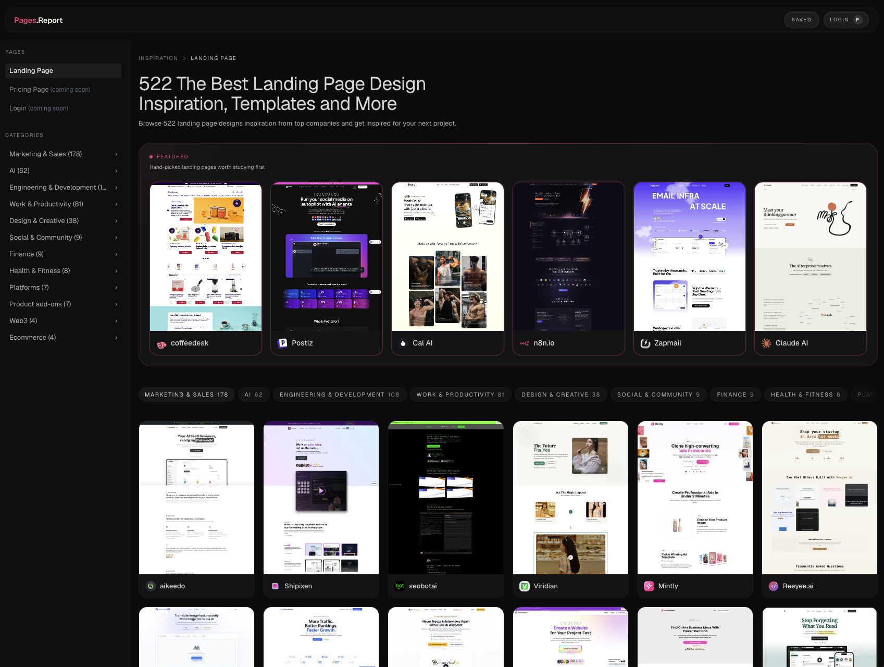

<a href="https://www.pages.report/?utm_source=github&utm_medium=social&utm_campaign=repo-banner">
     
</a>

<div align="center">

# Awesome DESIGN.md

**A curated collection of ready-to-use DESIGN.md files extracted from real websites.**

[](https://awesome.re)

[](https://github.com/korczivo/awesome-design-md)

</div>

---

Drop a `DESIGN.md` into your project root, tell your AI agent "build me a page that looks like this," and get UI that stays visually consistent — without Figma exports, JSON schemas, or any special tooling.

## What is DESIGN.md?

[DESIGN.md](https://stitch.withgoogle.com/docs/design-md/overview/) is a plain-text design system format introduced by Google Stitch. Because it's just Markdown, any AI coding agent reads it natively — no parsing, no configuration.

| File | Who reads it | What it defines |
|------|-------------|-----------------|
| `AGENTS.md` | Coding agents | How to build the project |
| `DESIGN.md` | Design agents | How the project should look and feel |

## Available Designs

| Site | Folder | Style |
|------|--------|-------|
| Claude AI | [design-md/claude-ai/](design-md/claude-ai/) | Minimal, warm neutral |
| Coffeedesk | [design-md/coffeedesk/](design-md/coffeedesk/) | E-commerce, clean |
| n8n | [design-md/n8n/](design-md/n8n/) | Dark, technical |
| Postiz | [design-md/postiz/](design-md/postiz/) | SaaS dashboard |
| Zapmail | [design-md/zapmail/](design-md/zapmail/) | Product, modern |

## What's Inside Each DESIGN.md

Every file follows the [Stitch DESIGN.md specification](https://stitch.withgoogle.com/docs/design-md/specification/):

| # | Section | What it captures |
|---|---------|-----------------|
| 1 | Visual Theme & Atmosphere | Mood, density, design philosophy |
| 2 | Color Palette & Roles | Semantic name + hex + functional role |
| 3 | Typography Rules | Font families, full hierarchy table |
| 4 | Component Stylings | Buttons, cards, inputs, navigation with states |
| 5 | Layout Principles | Spacing scale, grid, whitespace philosophy |
| 6 | Depth & Elevation | Shadow system, surface hierarchy |
| 7 | Do's and Don'ts | Design guardrails and anti-patterns |
| 8 | Responsive Behavior | Breakpoints, touch targets, collapsing strategy |
| 9 | Agent Prompt Guide | Quick color reference, ready-to-use prompts |

## How to Use

1. Pick a design from the table above and open its folder
2. Copy the `DESIGN.md` file into your project root
3. Prompt your AI agent:

```
Use DESIGN.md to build [describe your component or page].
```

That's it — the agent reads the file and generates UI that matches the design language.

## Contributing

Pull requests welcome. To add a new site, create a folder under `design-md/<site-name>/` with a `DESIGN.md` following the Stitch specification format.

## License

[MIT](LICENSE)
